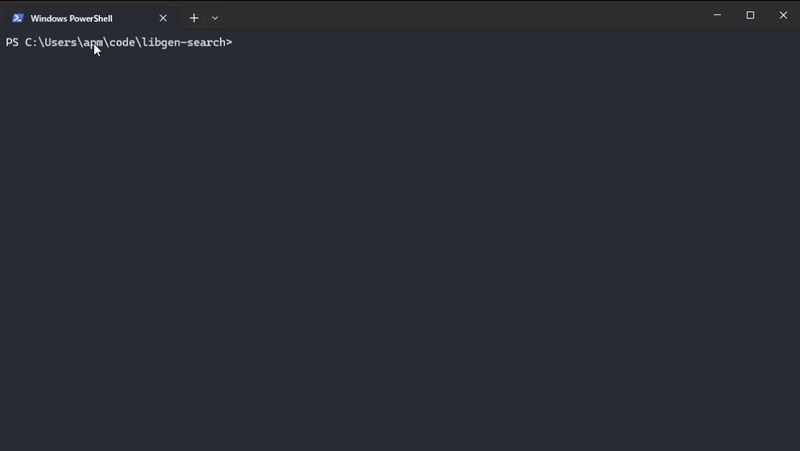

### Bookraid

Nifty [bubbletea](https://github.com/charmbracelet/bubbletea) program to get books in the fiction category from Libgen. I use it to try out books or find copies of certain editions I can't find for sale anywhere. Please, please support authors by purchasing books from them directly!



#### Usage

Run `main.go`, you can change URL and destination parameters in `main.go`. Alternatively, if you're on Windows, you can run the Windows binary.

```
# Run program
go run cmd/main.go

# Build from source
go build -o bookraid.exe cmd/main.go
```

---

#### Possible additions

Features in order of my priority;

-   download progress bar
-   more customization options - set a download path, search different categories (namely papers)
-   support bulk downloads
